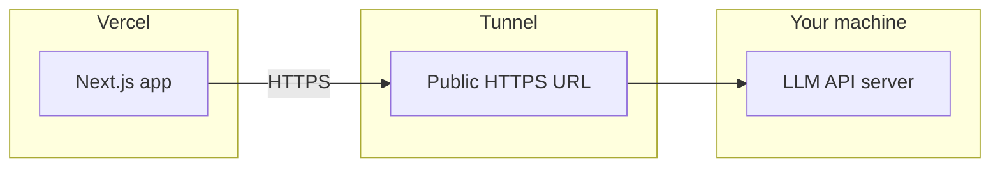

# LLM frontend ↔ local backend (Vercel + tunnel)

This project can call an LLM HTTP API hosted on your machine and exposed through a tunnel (for example [localtunnel](https://localtunnel.github.io/www/)), while the Next.js UI runs on Vercel or locally.

## Architecture



- **Frontend**: `https://your-app.vercel.app` (or `http://localhost:3000` during local dev).
- **Backend**: Node (or other) process on your machine listening on a port (example: `3001`).
- **Tunnel**: forwards `https://<subdomain>.loca.lt` → `http://localhost:<port>`.

The browser always talks to the **public tunnel URL**. It never needs to reach `localhost` on your laptop when users are on the public internet.

## Environment variables

| Variable | Purpose |
|----------|---------|
| `NEXT_PUBLIC_LLM_API_URL` | Base URL **without** a trailing slash. Used by `/test-connection` in the browser and by **`/api/chat` on the server** when no override is set. |
| `NEXT_PUBLIC_LLM_API_KEY` | Optional Bearer token (exposed to the browser if set here). |
| `LLM_HTTP_API_BASE_URL` | Optional. If set, **server-only** base URL for chat; overrides `NEXT_PUBLIC_LLM_API_URL` for `POST /api/chat` so you can keep a different public URL for client-side tests. |
| `LLM_HTTP_API_KEY` | Optional server-only Bearer token (preferred over `NEXT_PUBLIC_LLM_API_KEY` for secrets). |
| `LLM_SYSTEM_PROMPT` | Optional default `systemPrompt` sent on every chat request. |
| `LLM_TEMPERATURE` | Optional number (default `0.7`) for the chat request body. |

Copy `.env.example` to `.env.local` for local development. On Vercel, set the same keys under **Project → Settings → Environment Variables**, then redeploy.

**Note:** Anything prefixed with `NEXT_PUBLIC_` is exposed to the browser. Prefer `LLM_HTTP_API_KEY` on the server when you need a secret.

## Main chat (`/chat`, Chatbot)

The product UI still uses `useChat` → **`POST /api/chat`** (Next.js). That route:

1. Verifies the Supabase session (same as before).
2. If **`LLM_HTTP_API_BASE_URL`** or **`NEXT_PUBLIC_LLM_API_URL`** is set, it calls your LLM service at **`POST {base}/api/chat`** with `{ message, conversationId?, systemPrompt?, temperature? }`.
3. Saves the provider’s `conversationId` on the session as **`chat_sessions.metadata.llm_conversation_id`** so the next message continues the same LLM thread.
4. Inserts **user** and **assistant** rows into **`messages`** so history stays in Supabase.

No change is required in `Chatbot` / `ChatWindow` beyond environment configuration.

If **no** LLM HTTP base URL is set, the route uses the **legacy Flask** backend (`NEXT_PUBLIC_BACKEND_API_URL` + `LLM_API_KEY` + full `messages` array).

## Start the backend

Exact commands depend on your LLM server repo. Typically:

1. Install dependencies.
2. Start the API on a fixed port (example `3001`).
3. Confirm locally:

```bash
curl http://localhost:3001/health
```

You should see JSON like:

```json
{ "status": "ok", "model": "...", "timestamp": "..." }
```

## Start the tunnel

With [localtunnel](https://www.npmjs.com/package/localtunnel) (example):

```bash
npx localtunnel --port 3001
```

Use the printed HTTPS URL as `NEXT_PUBLIC_LLM_API_URL`. Tunnel URLs often **change each session** unless you use a reserved subdomain (paid / configured).

After the tunnel is up:

```bash
curl https://YOUR-SUBDOMAIN.loca.lt/health
```

First-time visits to some tunnel hosts may show an interstitial page; complete it in a browser once if required.

## App routes for testing

- **`/test-connection`** — buttons for **Test Health** and **Test Chat**, status, raw response, and a log panel.
- **`ChatComponent`** (`components/ChatComponent.jsx`) — optional UI built on `useLLM` (`hooks/use-llm.js`).

## Troubleshooting

| Symptom | Likely cause | What to try |
|--------|----------------|-------------|
| `NEXT_PUBLIC_LLM_API_URL is not configured` | Env not loaded | Add to `.env.local`, restart `next dev`, or set on Vercel and redeploy. |
| CORS errors in the browser | Backend CORS policy | Allow your Vercel origin (or `*` in dev). Your spec says dev allows all origins—ensure the server sends appropriate `Access-Control-Allow-*` headers. |
| Tunnel 502 / connection refused | Backend not running or wrong port | `curl` localhost health; fix port; restart tunnel pointing at that port. |
| First tunnel request shows HTML, not JSON | Tunnel browser warning | Open the tunnel URL in a browser, pass the warning, retry. |
| Chat returns 4xx/5xx | Body shape or auth | Compare with `POST /api/chat` contract: `message`, optional `conversationId`, `systemPrompt`, `temperature`. |
| Vercel works, tunnel URL changed | New tunnel session | Update `NEXT_PUBLIC_LLM_API_URL` on Vercel and redeploy, or use a stable tunnel hostname. |

## Security notes

- Prefer a **dedicated** backend API key and rotate it if the tunnel URL is shared.
- Tunnels expose your machine to the internet—run only what you need, keep the API minimal, and firewall appropriately.
